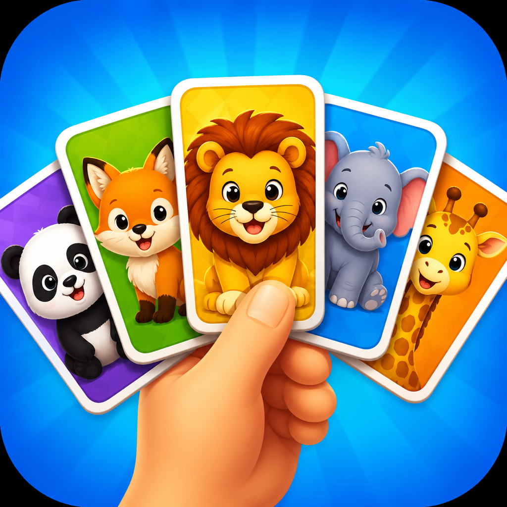

<div align="center">



# 🎬 MemoTest

### Un juego de memoria para descubrir películas mientras ejercitás tu mente

[](https://www.swift.org/)
[](https://developer.apple.com/xcode/swiftui/)
[](https://developer.apple.com/ios/)
[](https://developer.apple.com/xcode/)
[](https://www.themoviedb.org/)

</div>

---

## 📖 Descripción

**MemoTest** es una aplicación desarrollada con SwiftUI que transforma el clásico juego de encontrar parejas en una experiencia temática de cine.

La aplicación obtiene géneros y películas desde la API de [The Movie Database (TMDB)](https://www.themoviedb.org/), genera un tablero aleatorio con los pósteres y desafía al jugador a encontrar las ocho parejas. Cada acierto suma puntos y, al terminar la partida, el resultado se guarda localmente para mostrar el mejor puntaje de cada género.

## ✨ Funcionalidades

- 🎬 Consulta de géneros cinematográficos desde TMDB.
- 🎲 Selección aleatoria de películas según el género elegido.
- 🃏 Tablero de 16 cartas con 8 parejas de pósteres.
- 🔀 Mazo mezclado en cada partida.
- 🎯 Sistema de puntaje: **10 puntos por pareja encontrada**.
- 🧠 Control de cartas seleccionadas, coincidencias y bloqueos durante las animaciones.
- 🏆 Pantalla de resultado al completar todas las parejas.
- 💾 Historial persistente y mejor puntaje por género mediante SwiftData.
- 🖼️ Descarga, caché y precarga de imágenes con Kingfisher.
- 🎨 Animaciones de giro 3D y pantalla de carga con Lottie.
- 🌎 Contenido solicitado en español de Argentina (`es-AR`).
- ♿ Etiqueta de accesibilidad para la navegación de regreso.

## 🎮 Cómo se juega

1. Abrí la aplicación y esperá a que se carguen los géneros disponibles.
2. Elegí un género cinematográfico.
3. Tocá una carta para descubrir el póster que contiene.
4. Seleccioná una segunda carta:
   - si ambas pertenecen a la misma película, la pareja queda resuelta y suma 10 puntos;
   - si son diferentes, se ocultan nuevamente después de una breve pausa.
5. Encontrá las ocho parejas para terminar la partida.
6. Volvé al inicio para consultar el mejor puntaje guardado en cada género.

## 🛠️ Tecnologías utilizadas

| Tecnología | Uso dentro del proyecto |
|---|---|
| **Swift** | Lenguaje principal de desarrollo |
| **SwiftUI** | Construcción declarativa de la interfaz |
| **Observation** | Estado observable de los ViewModels mediante `@Observable` |
| **Swift Concurrency** | Operaciones asíncronas con `async/await`, actores y task groups |
| **SwiftData** | Persistencia local de resultados y mejores puntajes |
| **URLSession** | Comunicación con la API REST de TMDB |
| **Kingfisher 8.11.0** | Descarga, caché y precarga de pósteres |
| **Lottie 4.6.1** | Animación de la pantalla de carga |
| **Swift Testing** | Pruebas unitarias del gameplay, generadores y adaptadores |
| **XCTest** | Pruebas de interfaz y rendimiento de inicio |

## 🏗️ Arquitectura

El proyecto utiliza una arquitectura **MVVM**, complementada con los patrones **Coordinator**, **Router**, **Repository** e **inyección de dependencias**.

```text
Vista (SwiftUI)
      │
      ▼
ViewModel (@Observable)
      │
      ├── Router ──► Coordinator ──► NavigationStack
      │
      ├── Repositories ──► TMDB / caché de imágenes
      │
      └── SwiftData ──► resultados locales
```

### Responsabilidades principales

- **Views:** presentan la interfaz y envían las acciones del usuario al ViewModel.
- **ViewModels:** contienen el estado y la lógica de presentación de cada pantalla.
- **Routers:** construyen destinos y delegan la navegación al coordinador.
- **AppCoordinator:** administra el `NavigationPath` compartido por la aplicación.
- **Repositories:** abstraen el acceso a TMDB, la carga de imágenes y la persistencia.
- **DTOs y adapters:** convierten las respuestas de TMDB en modelos del dominio.
- **Generators:** crean las parejas, precargan sus pósteres y mezclan el mazo.

## 🗂️ Estructura del proyecto

```text
MemoTest/
├── Config/
│   ├── Shared.xcconfig
│   └── Secrets.xcconfig.example
├── MemoTest.xcodeproj/
├── MemoTest/
│   ├── Coordinator/
│   ├── Gameplay/
│   │   ├── Generators/
│   │   ├── GameplayRouter.swift
│   │   ├── GameplayView.swift
│   │   └── GameplayViewModel.swift
│   ├── Home/
│   ├── Model/
│   │   ├── Dominio/
│   │   ├── DTO/
│   │   └── Globals/
│   ├── Networking/
│   │   ├── Core/
│   │   └── Repositories/
│   ├── SwiftData/
│   ├── Assets.xcassets/
│   ├── Lotties/
│   └── MemoTestApp.swift
├── MemoTestTests/       # Pruebas unitarias
└── MemoTestUITests/     # Pruebas de interfaz y lanzamiento
```

## 🔄 Flujo de datos

1. `HomeViewModel` solicita la lista de géneros a `TMDBGenreService`.
2. El repositorio transforma los DTOs recibidos en modelos `GenreObject`.
3. Al elegir un género, `HomeRouter` crea el generador y el ViewModel de la partida.
4. `MoviesCardGenerator` consulta una página aleatoria de películas del género, toma hasta ocho resultados, duplica cada carta y mezcla el mazo.
5. `ImageCaptureService` precarga en paralelo los pósteres mediante Kingfisher.
6. `GameplayViewModel` administra selecciones, coincidencias, puntaje y fin de partida.
7. Al completar el tablero, `GameResultSaveData` persiste el resultado con SwiftData.
8. Al regresar al inicio, el mejor puntaje de cada género se calcula a partir de los resultados guardados.

## 📦 Requisitos

- macOS con **Xcode 16.4 o superior**.
- **iOS/iPadOS 18.5 o superior** como destino de la aplicación.
- Swift configurado en el proyecto como **Swift 5**.
- Conexión a internet para consultar TMDB y descargar los pósteres.
- Una cuenta de desarrollador de Apple solo si se desea ejecutar en un dispositivo físico o distribuir la aplicación.
- Una credencial válida de lectura para la API de TMDB.

## 🚀 Instalación y ejecución

### 1. Clonar el repositorio

```bash
git clone https://github.com/AlexisVaglica/MemoTest.git
cd MemoTest
```

### 2. Abrir el proyecto

```bash
open MemoTest/MemoTest.xcodeproj
```

Xcode resolverá automáticamente las dependencias administradas con Swift Package Manager. Si fuera necesario, se pueden actualizar desde **File › Packages › Resolve Package Versions**.

### 3. Configurar la firma

1. Seleccionar el target **MemoTest**.
2. Abrir **Signing & Capabilities**.
3. Elegir el equipo de desarrollo correspondiente.
4. Cambiar el Bundle Identifier si el actual no está disponible para esa cuenta.

### 4. Configurar TMDB

El proyecto consume los endpoints `/genre/movie/list` y `/discover/movie` de TMDB mediante autenticación Bearer.

1. Crear una cuenta en [TMDB](https://www.themoviedb.org/signup).
2. Solicitar una credencial de lectura en la sección de configuración de la API.
3. Crear la configuración local a partir del ejemplo:

```bash
cp MemoTest/Config/Secrets.xcconfig.example MemoTest/Config/Secrets.xcconfig
```

4. Abrir `MemoTest/Config/Secrets.xcconfig` y reemplazar el valor de ejemplo:

```xcconfig
TMDB_ACCESS_TOKEN = tu_nuevo_token_de_lectura_de_tmdb
```

`Secrets.xcconfig` está excluido mediante `.gitignore`. `Shared.xcconfig` lo carga de forma opcional y Xcode incorpora el valor en la clave `TMDBAccessToken` del `Info.plist` generado durante la compilación. El cliente de red lee esa clave en tiempo de ejecución; si no está configurada, las solicitudes finalizan con `NetworkError.missingAccessToken`.

### 5. Ejecutar

1. Seleccionar el scheme **MemoTest**.
2. Elegir un simulador o dispositivo compatible.
3. Presionar **Run** (`⌘R`).

## 🧪 Pruebas

El proyecto incluye pruebas para:

- estado inicial del juego;
- carga de cartas boca abajo y sin coincidencias previas;
- selección y giro de la primera carta;
- detección de una pareja correcta;
- generación de mazos mediante dobles de prueba;
- adaptación de DTOs de películas y géneros;
- lanzamiento y rendimiento inicial de la interfaz.

Para ejecutar toda la suite desde Xcode, usar **Product › Test** (`⌘U`). También puede ejecutarse desde la terminal, reemplazando el nombre del simulador si fuera necesario:

```bash
xcodebuild test \
  -project MemoTest/MemoTest.xcodeproj \
  -scheme MemoTest \
  -destination 'platform=iOS Simulator,name=iPhone 16 Pro'
```

## 🌐 Integración con TMDB

| Recurso | Endpoint | Finalidad |
|---|---|---|
| Géneros | `GET /3/genre/movie/list` | Obtener las categorías disponibles |
| Películas | `GET /3/discover/movie` | Buscar películas por género y página |
| Imágenes | `https://image.tmdb.org/t/p/w500/` | Construir las URLs de los pósteres |

Las consultas utilizan el idioma `es-AR`. Para aportar variedad, cada partida selecciona aleatoriamente una de las primeras 20 páginas de resultados y utiliza hasta ocho películas.

> [!NOTE]
> Este producto utiliza la API de TMDB, pero no está respaldado ni certificado por TMDB.

## 💾 Persistencia

Cada partida completada se guarda como un modelo `GameResult` con:

- `score`: puntaje final obtenido;
- `genreID`: identificador del género elegido.

La pantalla principal recupera todos los resultados almacenados, los agrupa por género y muestra el puntaje máximo. Los datos permanecen de forma local en el dispositivo mediante SwiftData.

## 🧩 Dependencias

Las dependencias se integran con Swift Package Manager y sus versiones resueltas quedan registradas en `Package.resolved`.

| Paquete | Versión resuelta | Repositorio |
|---|---:|---|
| Kingfisher | 8.11.0 | [onevcat/Kingfisher](https://github.com/onevcat/Kingfisher) |
| Lottie | 4.6.1 | [airbnb/lottie-ios](https://github.com/airbnb/lottie-ios) |

## 🤝 Contribuciones

Las contribuciones son bienvenidas. Para proponer un cambio:

1. Hacer un fork del repositorio.
2. Crear una rama descriptiva: `git switch -c feature/nueva-funcionalidad`.
3. Realizar los cambios y agregar pruebas cuando corresponda.
4. Confirmar los cambios: `git commit -m "feat: agregar nueva funcionalidad"`.
5. Subir la rama: `git push origin feature/nueva-funcionalidad`.
6. Abrir un Pull Request explicando el objetivo y el alcance de la propuesta.

## 🗺️ Posibles mejoras

- Incorporar estados de error y reintento en las pantallas de inicio y juego.
- Agregar niveles de dificultad y cantidad de parejas configurable.
- Implementar cronómetro, penalizaciones por intento y ranking histórico.
- Incorporar pruebas de red con respuestas simuladas y más pruebas de interfaz.
- Añadir capturas de pantalla, modo oscuro y una experiencia de accesibilidad ampliada.
- Permitir reiniciar una partida sin regresar a la pantalla principal.

## 📜 Licencia

Este repositorio no incluye actualmente un archivo de licencia. Por lo tanto, se aplican los derechos de autor predeterminados y no se concede permiso automático para copiar, modificar o redistribuir el código.

Si el proyecto se publicará como código abierto, se recomienda agregar una licencia como [MIT](https://choosealicense.com/licenses/mit/) o la que mejor se adapte a sus objetivos.

## 👤 Autor

Desarrollado por **Alexis Vaglica**.

- GitHub: [@AlexisVaglica](https://github.com/AlexisVaglica)
- Repositorio: [AlexisVaglica/MemoTest](https://github.com/AlexisVaglica/MemoTest)

## 💜 Agradecimientos

- [The Movie Database](https://www.themoviedb.org/) por la información y las imágenes cinematográficas.
- [Kingfisher](https://github.com/onevcat/Kingfisher) por la gestión eficiente de imágenes remotas.
- [Lottie](https://github.com/airbnb/lottie-ios) por las animaciones vectoriales.

---

<div align="center">

Hecho con 💜, Swift y muchas películas.

</div>
